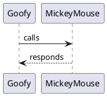

# Welcome to MkDocs - Material - PlantUML

Create a branded static site from a set of Markdown files to host the document.

## Inline PlantUML

```plantuml
@startuml

Goofy ->  MickeyMouse: calls
Goofy <-- MickeyMouse: responds

@enduml
```
